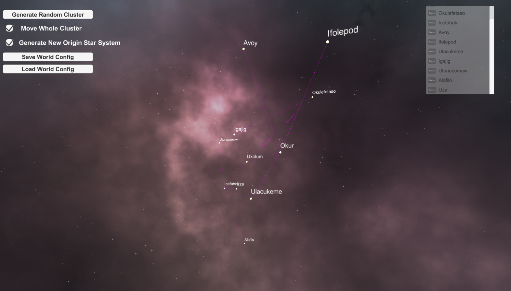

# 自定义世界观工具站 DIY-World-Settings-Toolset

[纯中文](./readme_cn.md)

[English_only](./readme_eng.md)

### 简介 Introduction

此工具集的初衷是集成地图制作-时间线设定-事件绑定-文本管理等功能, 在世界观设定与展示上提供方便. 

The original intention of this tool set is to integrate functions such as map making, timeline setting, event binding and text management, etc., to provide convenience in DIY world settings and presenting.

### 起因 Origin

很多脑洞大开的创作者在创作地图时, 如果不具备手工绘制能力, 或想将设定电子化, 只能依赖 Excel 表格等原始手段. 这导致大多数时候地图格子只能是方形, 时间线的演进需要切换多张表格, 协作创作更是涉及到手动表格合并. 

Many creators in the field of DIY World Setting or map making can only rely on "traditional" means such as Excel tables if they do not have the ability to draw manually or want to electronically create their maps. This means that most of the times the cells in the map can only be rectangular, and demonstrating the timeline involves switching between multiple tables, and that collaborative creation involves manual table merging.

一次和朋友聊天聊到一个科幻背景的刻画, 恰逢沉迷P社五萌之一的群星, 萌生了以图论为理论基础构建一套完整的地图生成与设定体系的想法. 

A chat with a friend about a depiction of a sci-fi background coincided with my temporary addiction to Stellaris, a Paradox game, and the idea of building a complete map generation and setting system based on Graphs (the mathematical concept) came into one's mind.

### 总体设计 Overall Design

理想的状态类似群星的星系地图, 用点代表星系, 线代表星系之间的连接, 以此构成星系网络. 每个点可以设定自己的状态, 比如恒星类型, 星系数量, 控制者等, 也可以选中一大批星系进行批量操作, 比如设定是哪个国家/文明控制这些星系, 或将这些星系归属于一个相同的"星区"(可能会涉及到地图切片分区的功能); 星系间的连接可以手动增删, 编辑者也可以给出自定义的对于这个连接的解释(若不同于类似群星的超空间航道). 

The ideal state is similar to a galaxy map of the game Stellaris, with dots representing star systems and lines representing connections between them, forming a galaxy network. Each point can be set its own state, such as star type, number of planets, occupying empire, etc., and also star systems can be selected for batch operations, such as setting which country/civilization controls them, or assigning these systems to the same "cluster" (may involve the function of tile mapping or map slicing, like ArcGIS); connections between star systems can be manually added or deleted, and editors can also give a custom interpretation of this connection (if different from a hyperlane like in Stellaris).

这些称之为一个时间切片, 若干个时间切片组合在一起则形成了时间线. 时间切片可以自定义年份(愿意的话胡扯一个数就行). 理想的流程是完成初始状态的设定后复制多个时间切片, 对单个进行修改以显示不同时间的不同状态; 典型的则是星系控制权的变化. 

These are called a Time Slice, and several Time Slices are combined to form a Time Line. The actual "year" which the Time Slice represents can be customized (if you want to make an arbitrary number, feel free). The ideal process is to copy multiple Time Slices after completing the setting of the initial state, and the individual slices are modified to show different states at different times; for instance the change in occupier.

绑定事件方面, 可以对星系或片区赋予一段文本说明(纯文本或外界文档), 时间切片之间可以共享, 也可以覆盖. 至于文本管理, 则是为了解决创作者自己维护多个文件夹里不同的word文档的痛点. 

In terms of event binding, a text description (plain text or external document) can be given to the star system or cluster, and Time Slices can share or overwrite them. As for text management, it is to solve the problem of creators maintaining multiple folders of different Word documents.

### 现状 Current State / To-do List

目前因为作者技术栈有限, 选择了Unity进行原型开发, 同时也意识到这样一个工具集软件可能更适合变成一个普通的软件甚至是网页, 所以如果有能力欢迎联系. 

At present, because the author's skill set is limited, Unity is chosen for prototype development, and also one realized that such a toolset software may be more suitable for becoming a normal "software" or even a web page, so if you have related skills, please feel free to get in touch.

以下是所有 **已完成** / *未完成* / 正在开发 的功能: 

 - **随机星系团生成(3D)**
    - **生成并并入当前星系团**
    - **生成分离的新星系团**
    - *限制高度以生成2D地图*
 - **星系移动**
    - **星系团整体移动**
    - *所有星系移动*
 - **观察视角自由移动**
    - *所有星系列表*
       - *快速移动视角到选定星系*
    - *视角角度快速选项*
       - *演示视图*
 - *事件绑定*
    - *绑定至星系*
    - *绑定至星区*
    - *设定星区(星区与生成时的星系团也许可以是一个东西)*
 - *时间线设定*
    - *多个时间线操作与管理*
 - *文本管理*
 - 世界观保存
    - **世界观导入**
    - **世界观导出**
    - *多人协作*

Here are all **completed** / *incomplete* / in development features:

 - **Random Cluster Generation (3D)**
    - **Generate to current Cluster**
    - **Generate New Cluster**
    - *Restrict the height variance to generate 2D Map*
 - **Move a Star System**
    - **Move a Cluster**
    - *Move All Star Systems*
 - **Camera Movement**
    - *List of all systems*
       - *move the camera to the selected system*
    - *Quick switch of camera angles*
       - *Presentation Mode*
 - *Event Binding*
    - *Bind event to star system*
    - *Bind event to cluster*
    - *Edit the cluster (membership etc)*
 - *Time Slice Editing*
    - *Time Line Management*
 - *Text Management*
 - Save World Settings
    - **Import World Settings**
    - **Export World Settings**
    - *Collaboration*

### 发布 Publishing

争取在九月份前发布第一个Unity/Windows版本, 期间可能会发布预览版, 提供部分做完了的功能. 

Currently aiming to release the first Unity/Windows version by September, during which there may be several preview releases with some completed features.

2022.08: 第一个预览版v0.1-alpha已经在release中发布, 为Unity打包的exe软件, 具体说明详见release内的readme. 

Aug 2022: The first alpha version v0.1 is avaialable for download in the release page, it's an executable built with Unity. More details can be found in the readme file in the release itself. 
    