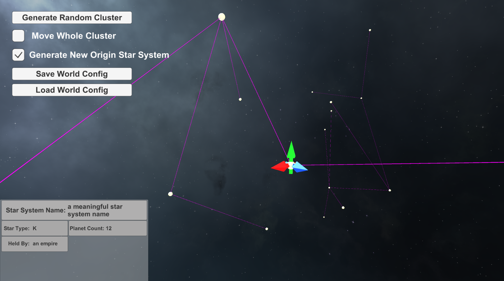

# DIY-World-Settings-Toolset

[CN+ENG](./readme.md)

### Introduction

The original intention of this tool set is to integrate functions such as map making, timeline setting, event binding and text management, etc., to provide convenience in DIY world settings and presenting.

### Origin

Many creators in the field of DIY World Setting or map making can only rely on "traditional" means such as Excel tables if they do not have the ability to draw manually or want to electronically create their maps. This means that most of the times the cells in the map can only be rectangular, and demonstrating the timeline involves switching between multiple tables, and that collaborative creation involves manual table merging.

A chat with a friend about a depiction of a sci-fi background coincided with my temporary addiction to Stellaris, a Paradox game, and the idea of building a complete map generation and setting system based on Graphs (the mathematical concept) came into one's mind.

### Overall Design

The ideal state is similar to a galaxy map of the game Stellaris, with dots representing star systems and lines representing connections between them, forming a galaxy network. Each point can be set its own state, such as star type, number of planets, occupying empire, etc., and also star systems can be selected for batch operations, such as setting which country/civilization controls them, or assigning these systems to the same "cluster" (may involve the function of tile mapping or map slicing, like ArcGIS); connections between star systems can be manually added or deleted, and editors can also give a custom interpretation of this connection (if different from a hyperlane like in Stellaris).

These are called a Time Slice, and several Time Slices are combined to form a Time Line. The actual "year" which the Time Slice represents can be customized (if you want to make an arbitrary number, feel free). The ideal process is to copy multiple Time Slices after completing the setting of the initial state, and the individual slices are modified to show different states at different times; for instance the change in occupier.

In terms of event binding, a text description (plain text or external document) can be given to the star system or cluster, and Time Slices can share or overwrite them. As for text management, it is to solve the problem of creators maintaining multiple folders of different Word documents.

### Current State / To-do List

At present, because the author's skill set is limited, Unity is chosen for prototype development, and also one realized that such a toolset software may be more suitable for becoming a normal "software" or even a web page, so if you have related skills, please feel free to get in touch.

Here are all **completed** / *incomplete* / in development features:

 - **Random Cluster Generation (3D)**
    - **Generate to current Cluster**
    - **Generate New Cluster**
    - *Restrict the height variance to generate 2D Map*
 - **Move a Star System**
    - **Move a Cluster**
    - *Move All Star Systems*
 - **Camera Movement**
    - *List of all systems*
       - *move the camera to the selected system*
    - *Quick switch of camera angles*
       - *Presentation Mode*
 - *Event Binding*
    - *Bind event to star system*
    - *Bind event to cluster*
    - *Edit the cluster (membership etc)*
 - *Time Slice Editing*
    - *Time Line Management*
 - *Text Management*
 - Save World Settings
    - **Import World Settings**
    - **Export World Settings**
    - *Collaboration*

### Publishing

Currently aiming to release the first Unity/Windows version by September, during which there may be several preview releases with some completed features.

Aug 2022: The first alpha version v0.1 is avaialable for download in the release page, it's an executable built with Unity. More details can be found in the readme file in the release itself. 
    